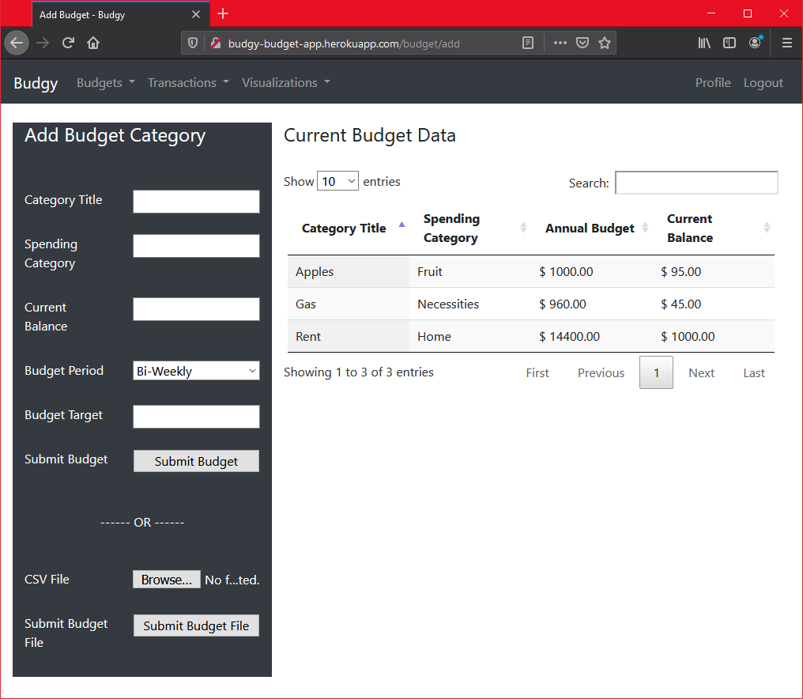
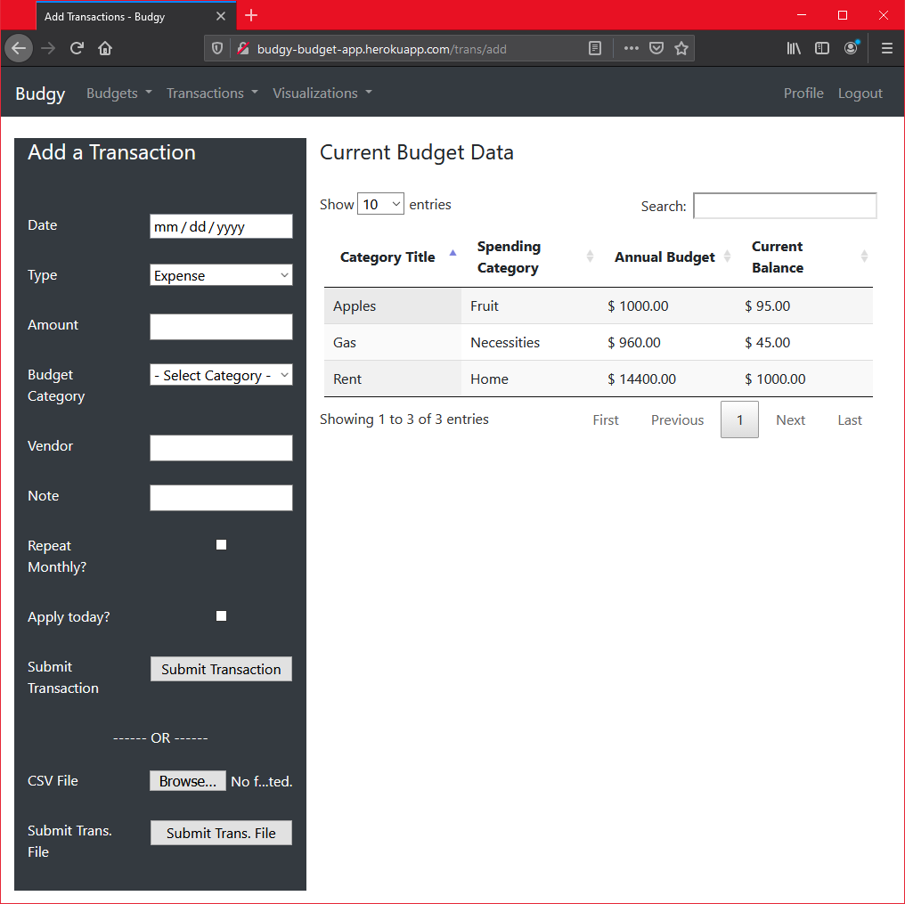
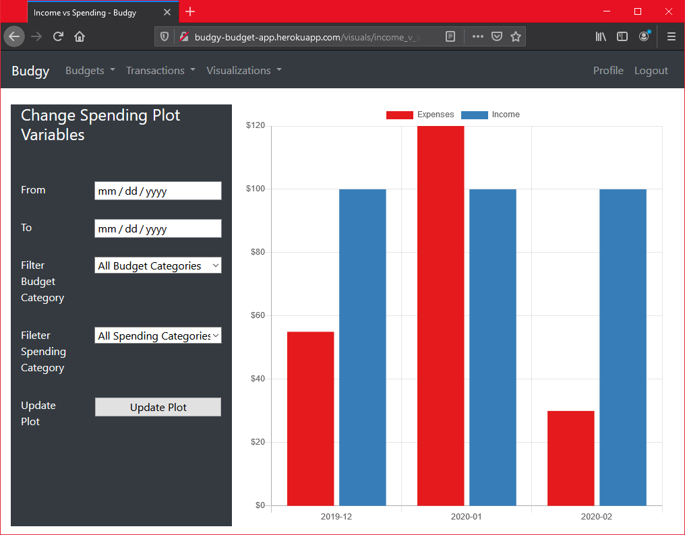

# budgy_app
 A flask web-app for tracking personal financial data.

<<<<<<< HEAD
<<<<<<< HEAD
Add budget categories, that track current balances and targeting budget values. 

Add transactions, which are applied to individual budgets and keep track of spending.

Visualize your spending over time or by category.

=======

>>>>>>> parent of 4469bb4... Update README.md
=======

>>>>>>> parent of 4469bb4... Update README.md
