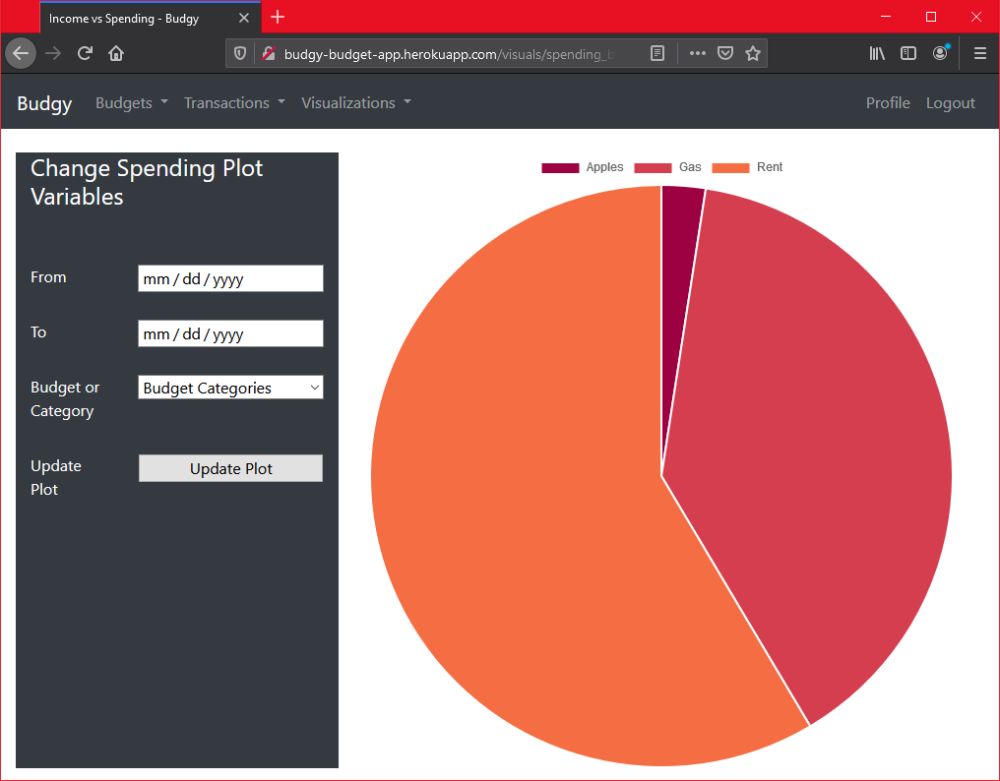

# budgy_app
 A flask web-app for tracking personal financial data.

Add budgets to target spending and track balances.

Add transactions to record spending as it happens. 

Visualize your spending over time or by category.

