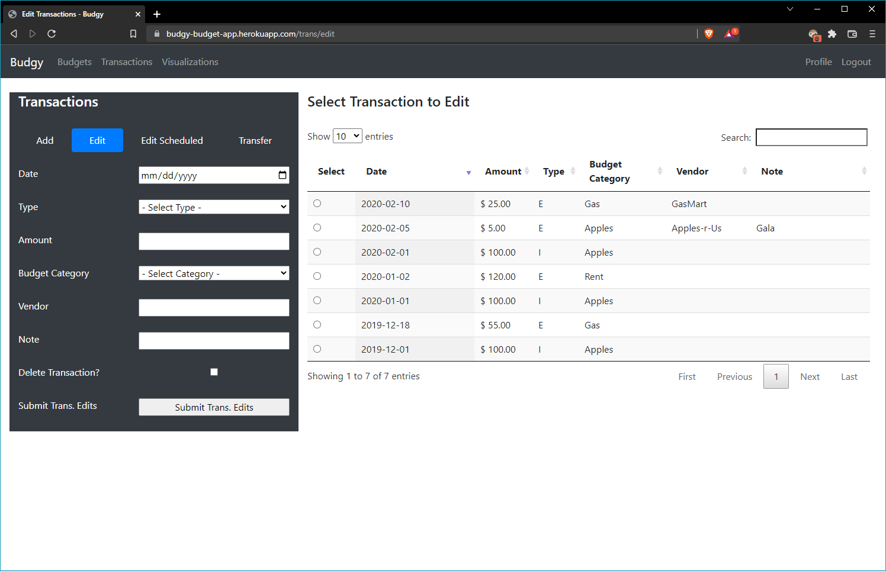
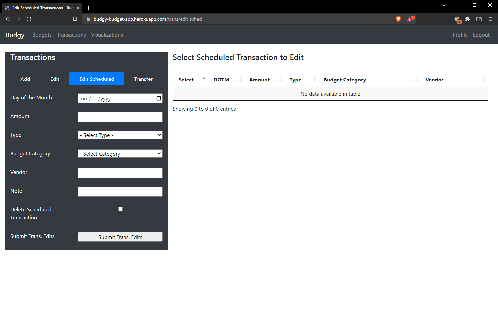

# Budgy!
 A flask web-app for tracking personal financial data.

### Budgets:

Add budgets to target spending and track balances. Categories budgets with a Spending category to further define your spending goals. 

Edit existing budgets when spending priorities change.

Add funds to a budget as income is received.

Delete budgets that are no longer applicable.

### Transactions:

Add transactions to record income and spending as it happens. Transactions can be one time or scheduled to recur. 

Edit posted transactions if you need to correct errors. 

Edit scheduled transactions to change date, amount, budget or delete a recurring expense. 

Need to move money between budgets? Transfer transactions allow you to do just that! 

### Data Visualization

Visualize your spending over time...

...or by category. 

And see a summary of transactions over the time period of your choosing:

